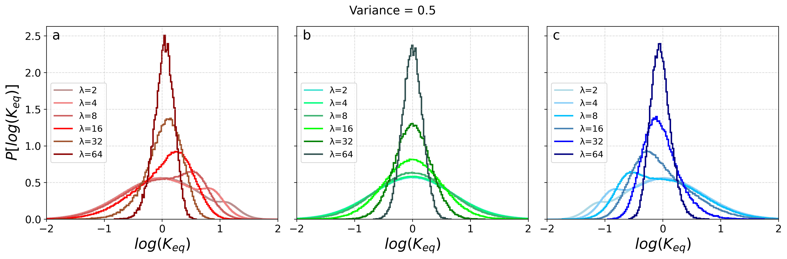
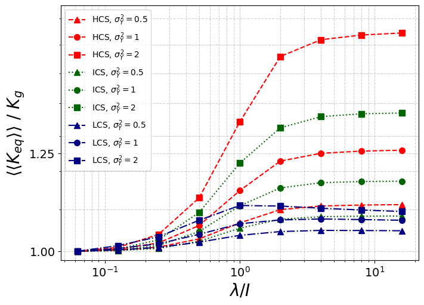
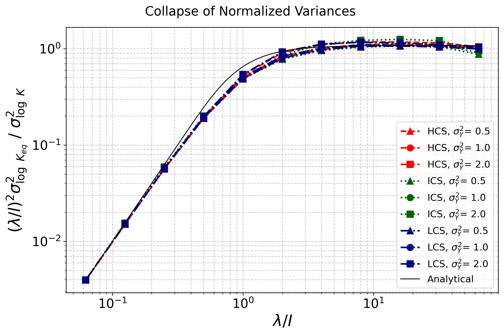

# Geological connectivity and hydraulic conductivity upscaling

This repository includes the data processing and the results of the research work called: "Geological facies connectivity and upscaling in reservoir simulation for optimization of production forecasts".

## Abstract

The simulation of fluid flow through porous media involves the development of mathematical and computational models based on geological data, geophysical surveys and petrophysical properties of the reservoir rock. These data allow the construction of a map or fine grid of high resolution in which the simulation processes have high computational requirements. This is why it is necessary to perform an upscaling procedure in order to transfer the properties from the geological fine grid to a coarse simulation grid of lower resolution. It is essential in this process to ensure the least possible loss of information, especially of the heterogeneity of the media, since properties such as hydraulic conductivity and the connectivity of different conductive components of the reservoir strongly determine the flow and transport in the earth's subsurface. In this study, multi-gaussian media generated by random space functions is used to represent the large spatial variability of the hydraulic conductivity _k(**r**)_. This kind of media was found  to reproduce in good degree the distribution of conductivity hydraulics observed in field measurements, but the connectivity of the more conductive components or classes of kr that defines the flow and transport is not completely defined. For example, tortuous channels of high (kr) that give rise to fast fluid flow pathways, aren’t captured. In particular, for multi-gaussian media, the intermediate _k(**r**)_ classes form a connected network, while the extreme (high and low) _k(**r**)_ classes form isolated blobs. To take into account a wider range of connectivity scenarios, the multi-gaussian media is modified by applying a Normal Score Transform (NST) that performs a spatial swap of the intermediate _k(**r**)_ classes with the high (or the low) ones. After the NST, the _k(**r**)_ classes are spatially reorganized so that it is the high _k(**r**)_ classes (or the low ones) that form a connected network (or isolated blobs). Connected networks high (low) _k(**r**)_ classes mimic high (low) _k(**r**)_ tortuous channels (barriers) observed in natural media.  

## **1 - Introduction**

The characterization of the equivalent properties obtained in the upscaling processes of heterogeneous media has numerous applications in different areas of science and engineering. For several decades, the electrical conductivity and equivalent thermal conductivity of mixtures, as well as the elastic properties of composite materials, have been studied {Maxwell, 1873; Bruggeman, 1935; Landau & Lifshitz, 1960; Auriault, 1983; Willot & Jeulin, 2009; Zhou et al., 2016}. Specifically in environmental and energy applications, the determination of equivalent hydraulic conductivity is of great interest in various disciplines linked to flow and transport in porous media, such as the characterization of groundwater flow {Matheron, 1967; Dykaar & Kitanidis, 1992; Sanchez-Vila & Carrera, 1997}, subsurface transport of solutes and pollutants {Panagiotou, & Kiriakidis, 2022; Schiavo et al., 2023}, production of geothermal renewable energy {Weijermars & Khanal, 2019; Hadrien et al., 2023}, applications for the energy transition such as carbon dioxide capture, utilization and storage (CCUS) {Bigi et al., 2013} combined with unconventional enhanced gas recovery (EGR) {Zhao, 2021, Renard & Ababou, 2022}, underground hydrogen storage {Zivar et al., 2021} and oil and gas reservoir engineering {Renard & de Marisily, 1997; Weijermars & Khanal, 2019}.

A long-standing question is how to retain the salient features of the original description while reducing the spatial or temporal resolution, typically by applying some sort of “low-pass filter”  {Germano, 1992, Dykaar & Kitanidis, 1992 (a), Dykaar & Kitanidis, 1992 (b)} with a given cutoff scale. For example, large eddy simulations (LES) are a “filtered” representation that reduce the computational burden required to fully solve the Navier Stokes equations of fluid flow. LES simulations are aimed to preserve only the coarse-scale features of the flow velocity field, while averaging the small scale ones {Minotti, 2000; Johnson, 2022}. The unfiltered (and more cpu time consuming) alternative is to perform direct numerical simulations (DNS).

While these upscaling procedures reduce computing time, the implied information loss has drawbacks. For instance, in LES simulations of the flow of two immiscible phases, blurring of the interface is frequently observed {Lanbourasse et al., 2007}.  As sharpness is a very distinctive feature of these flows, any satisfactory upscaling procedure should be able to retain it {Tryggvason & Lu, 2020}.

In groundwater flow, at the  Darcy scale, the key features to be retained during the upscaling procedure are high hydraulic conductivity channels and low conductivity barriers, which mostly determine the structure of the fluid velocity field. In other words, it is the connectivity of the high or low conductivity components or classes (here we use the term “components” in general, and “classes” particularly for continuous media) that should be preserved during upscaling. This is why so much research effort aimed to define, characterize and quantify connectivity {Knudby & Carrera, 2005; Renard & Allard, 2013; Colecchio et al., 2021}.   

## **2 - Flow upscaling in multi-gaussian media**

From a numerical point of view, upscaling of groundwater flow at the Darcy scale implies coarse graining the hydraulic conductivity of heterogeneous media, from the local point values _k(**r**)_ provided by a geological description and defined over the fine grid, onto the equivalent conductivity _Keq_ values, defined over the coarse grid over which flow and transport simulations are performed.

At least four characteristic lengths are involved in the upscaling procedure: the linear size _Δ_ of the fine grid cell, or support scale; a characteristic length scale of the heterogeneity or integral scale *l* (if definable); the coarsening scale *λ*, defined by the linear size of the target coarse grid cell; and the overall linear size *L* of the domain under study, see the figure (**Fig. 1**) below for the spatial scales involved in the upscaling procedure.

**Fig. 1:** Scheme of the spatial scales involved in the upscaling procedure. (left) The local point values of hydraulic conductivity _k(**r**)_, here reflecting those of a 2D multigaussian media sample of linear size *L*, are defined over a fine grid with linear cell size *Δ* (this length is given by the image pixel size as show in the inset zoom). The integral scale *l* yields the heterogeneity characteristic length-scale. After upscaling (right), the equivalent hydraulic conductivity _Keq_ is defined over a coarse grid of linear cell size *λ*. This example corresponds to a 2D slice of a 3D media of linear size of *L*=256*Δ*, *l*=16*Δ* and *λ*=32*Δ*.

A transition is expected between *λ* ~ *Δ* and *λ* >> *l;* in the latter limit, homogenization is achieved, and _Keq_ becomes an intrinsic property of the media, the equivalent hydraulic conductivity, independently of *λ*. Also, large fluctuations typically appear when *λ* ~ *l* {Boschan & Nœtinger, 2012}. Because of this, the dimensionless form of the coarsening scale *λ/* is frequently used.

On the other hand, the large spatial variability of the hydraulic conductivity in the subsurface has very often been represented by using random space functions (RSF) {Dagan, 1989}. Multi-gaussian media, among other types of media generated by using RSF, were found to reproduce in good degree the distribution of *k(**r**)* observed in field measurements {Hoeksema & Kitanidis, 1985; Sudicky, 1986}, were thus thoroughly studied {Gelhar, 1986; Dreuzy, 2010}, and considered as a benchmark of heterogeneity. In these media, the point values of hydraulic conductivity *k(**r**)* are the result of a random process characterized by a unimodal Gaussian (or normal) probability density function _P_(_Y_), where _Y = log(k(**r**))_ (i.e. kr is lognormally distributed), geometric mean _Kg_ and logarithmic conductivity variance *$\sigma_{Y}^{2}$*. The first two parameters fully characterize _P_(_Y_) at the fine scale {Jankovic et al., 2017}, while the latter controls the degree of heterogeneity, which typically ranges over several orders of magnitude. Moreover, the spatial correlation of  *k(**r**)* is given by a isotropic covariance function $\delta$(Y) with a certain integral length scale _l_. As $\delta$(Y) is a smooth function, multi-gaussian media are continuous media, as opposed to, for example, boolean {Harter, 2005}, or categorical {Fleckenstein & Fogg, 2008} media. 

On the other hand, the stochastic approach involved in the use of RSF implies that, at the coarse scale, _Keq_  is not defined as a deterministic value, but over an ensemble of realizations, and then, in turn, also characterized by a probability density function P[log(Keq)] with arithmetic mean 〈_Keq_〉, geometric mean 〈〈_Keq_〉〉, log variance  $\sigma_{log\left(K_{eq}\right)}^{2}$ and skewness $\gamma_{log\left(K_{eq}\right)}$ (the skewness is the third gaussian moment of a distribution). Under ergodic conditions, $P\left[ log\left ( K_{eq} \right ) \right ]$ reflects both spatial and ensemble statistics.  

## **3 - Connectivity and equivalent hydraulic conductivity _Keq_** 

The connectivity of the more conductive components or classes of *k(**r**)* strongly determines _Keq_, but it is poorly captured by the most frequently used geostatistical descriptors (i.e. variogram), which are based on two-point statistics. For example, tortuous channels of high *k(**r**)*, that give rise to fast fluid flow pathways, aren’t captured. This motivated numerous studies that explored metrics or indicators as the source of more realistic and accurate connectivity metrics. 

In particular, for multi-gaussian media, the intermediate *k(**r**)* classes form a connected network, while the extreme *k(**r**)* classes form disconnected blobs. To take into account a wider range of connectivity scenarios {Zinn and Harvey 2003; Jankovic et al., 2017; Zarlenga et al., 2018} modified multi-gaussian media by applying a Normal Score Transform (NST) that performs a spatial swap of the intermediate kr classes with the high (or the low) ones. After the NST, the *k(**r**)* classes are spatially reorganized so that it is the high kr classes (or the low ones) that form a connected network (or isolated blobs).

Some 3D studies on equivalent hydraulic conductivity are available, but most previous works addressed only 2D cases due to the computational burden involved in 3D approaches. Very few works addressed 2D and 3D media simultaneously {Oriani, F. & Renard, P. 2014; Boschan, A. & Nœtinger, B. 2012}. As connectivity is intrinsically related to dimensionality, and because assessing the possible extrapolation of previous 2D results to 3D realistic cases is important, and, finally, to enhance the scope of our study, we have chosen to perform it both in 2D and 3D with the following connectivity structure characteristics:

<ul>
<li> Intermediate connectivity structure (ICS), the intermediate kr values form a connected network, while higher and lower kr values form isolated blobs. </li>
<li> High connectivity structure (HCS), the isolated zones with the low kr values are embedded in a matrix with the high *k(**r**)* values connected.</li>
<li> Low connectivity structure (LCS), the low *k(**r**)* values form the connected network and the highest form isolated blobs.</li>
<li> No structure (NS), spatially uncorrelated case used as a reference where there are not relation among kr classes.</li>
</ul>

In particular, a multi-gaussian media modified such as HCS mimics tortuous channels of high flow velocity, while a LCS type simulates flow barriers that could be observed in natural media. **Fig. 2** and **Fig. 3** shows examples of a realization of the $Y=log\left(k\left(\mathbf{r}\right)\right)$ for the different connectivity structures: no structure (NS), intermediate (ICS),  high (HCS) and low (LCS) structures for 2D and 3D, respectively. In the 2D cases the inset in the bottom left corner shows a zoom to highlight the media structures.

**Fig. 2:** Maps of **Y** $(log\left(k\left(\mathbf{r}\right)\right)$ of the 2D connectivity structures used in this study. (a, b, c, d) 2D samples with linear size *L*=1024*Δ*, the left bottom corner shows a zoom for easier visualization. (a) No structure, (b) intermediate, (c) high and (d) low connectivity structures.  

**Fig. 3:** Maps of **Y** $(log\left(k\left(\mathbf{r}\right)\right)$ of the 3D connectivity structures used in this study. (a, b, c, d) 3D samples with linear size *L*=256*Δ*. (a) intermediate, (b) high, (c) low and (d) no structure connectivity structuresd.  

## __4 - Results__

For each space dimention, we examine first the dependence of pdf $P\left[ log\left ( K_{eq} \right ) \right ]$ with the coarsening scale $\lambda$. Then, we analyze the ensemble arithmetic mean 〈_Keq_〉, the most frequently metric used in the literature to quantify _Keq_, its geometric mean〈〈_Keq_〉〉, and finally its variance  $\sigma_{log\left(K_{eq}\right)}^{2}$, these are 1st and 2nd gaussian moments of $P\left[ log\left ( K_{eq} \right ) \right ]$ respectively. Deviations of $P\left[ log\left ( K_{eq} \right ) \right ]$ from a normal distribution are addressed in the discussion by analyzing the skewness $\gamma$_log_(_Keq_) the 3rd gaussian moment of $P\left[ log\left ( K_{eq} \right ) \right ]$.  

### **a - 2D and 3D Probability Density Function $P\left[log\left(K_{eq}\right)\right]$**

**Fig. 4a and 4b** shows 2D and 3D $P\left[log\left ( K_{eq} \right ) \right ]$ for the high (HCS), intermediate (ICS) and low (LCS) connective structures for $\sigma_{Y}^{2}$ = 0.5, 1, 2. For ICS, in agreement with {boschan12, colecchio20}, $P\left[log\left(K_{eq}\right)\right]$ remains as a normal distribution at all coarsening scales _λ_, with  $\sigma_{log\left(K_{eq}\right)}^{2}$ decreasing as _λ_ increases. But, notably, for HCS and LCS ,  $\sigma_{log\left(K_{eq}\right)}^{2}$ departs from normal, showing lack of symmetry (or a bias) as _λ_ exceeds _Δ_, and then becoming symmetric as _λ_ increases. The most evident feature of the asymmetry is a small bump that moves centerward, from high (HCS) or low (LCS) values of $log\left(K_{eq}\right)$, as _λ_ increases. The asymmetry increases as $\sigma_{Y}^{2}$ increases. Also it is observed that $\sigma_{log\left(K_{eq}\right)}^{2}$ becomes more homogeneous as _λ_ becomes larger and more compact and wider as $\sigma_{Y}^{2}$ increases. 

    
              
 **Fig. 4a:** 2D PDF.  

    
                     
 **Fig. 4b:** 3D PDF.  

### __b - 2D and 3D Arithmetic mean ⟨_Keq_⟩__

**Fig. 5a** shows 2D **〈_Keq_〉/_Kg_** as a function of the dimensionless coarsening scale **$\lambda$/_l_**. It is observed in (b) (ICS) that **〈_Keq_〉** **$\rightarrow$** 
$\mathbf{K_{g}exp\left(\sigma_{Y}^{2}/2\right)}$ as **$\lambda$ $\rightarrow$ 0**, **〈_Keq_〉 $\rightarrow$ _Kg_**  for **$\lambda$ $\rightarrow$ $\infty$** and **〈_Keq_〉/_Kg_** converges to 1 (dotted black line) for all **$\sigma_{Y}^{2}$**. In (a) (HCS) the **〈_Keq_〉/_Kg_** values lie above 1 and in (c) (LCS) **〈_Keq_〉/_Kg_** values lie below 1 with an inversion for the different **$\sigma_{Y}^{2}$** values.

                                                                 
**Fig. 5a:** 2D arithmetic mean.  

**Fig. 5b** shows **〈_Keq_〉/_Kg_** as a function of **$\lambda$/_l_** for 3D media samples. The **Fig. 7b** in comparison with **Fig. 6b** shows that the results obtained by *Matheron 1967* for 2D when **$\lambda$ $\rightarrow$ $\infty$** are not applicable to 3D media.

On the other hand, for **$\lambda$=0** the **〈_Keq_〉/_Kg_** values for ICS (**Fig. 7b**) are equal with **_Ka_**. For **$\lambda$ $\rightarrow$ $\infty$**, the **♦** symbols indicate the **〈_Keq_〉/_Kg_** values for **$\sigma_{Y}^{2}$ = 0.5, 1, 2** according to the Landau–Matheron conjecture: $\mathbf{ K_{g}exp\left(\sigma _{Y}^{2}/6\right)}$, and it shows a good agreement with our numerical results.

The **x** symbols in **$\lambda$ $\rightarrow$ $\infty$** (**Fig 17a, b, c**) indicate the **〈_Keq_〉/_Kg_** value for **$\sigma_{Y}^{2}$ = 2** according to **Jankovic et al., 2017**. It can be observed that for ICS (**Fig. 7b**) the Jankovic value is in agreement with our numerical results, but for HCS and LCS (**Fig. 7a and 7c**) the fit is not so good.

The (**---, -.-, ...**) black lines in **Fig. 7b** are the analytical results given by Eq. 1.1.7 with D=3 and as=1.3 and predicts the **〈_Keq_〉/_Kg_** transition between the **_Ka_** and $\mathbf{K_{g}exp\left(\sigma _{Y}^{2}/6\right)}$ extreme values.

                                                                 
**Fig. 5b:** 3D arithmetic mean.  

### __c - 2D and 3D Geometric mean ⟨⟨_Keq_⟩⟩__

**Fig. 6a** shows the normalized geometric mean 〈〈_Keq_〉〉/_Kg_ as a function of $\lambda$/_l_ for HCS, ICS and LCS for 2D media samples. It is observed that 〈〈_Keq_〉〉=1 in ICS for all $\sigma_{Y}^{2}$ values and for all range of $\lambda$ in agreement with Matheron 1967. In HCS (LCS), ⟨⟨Keq⟩⟩ increases (decrease) progressively from 1 for low  to reach an asymptotic value for . The asymptotic values becomes larger (smaller) as $\sigma_{Y}^{2}$ increases.

**Fig. 6a:** 2D geometric mean.  

**Fig. 6b**: shows the normalized geometric mean **〈〈_Keq_〉〉/_Kg_** as a function of **$\lambda$/_l_** for HCS, ICS and LCS for 3D media samples. Unlike 2D medias samples, the ICS for all **$\sigma_{Y}^{2}$** values are different from 1 and do not comply with Matheron 1967. For all connectivity structures cases the **〈〈_Keq_〉〉/_Kg_** increases progressively from **1** for low **$\lambda$** to reach an asymptotic value that is greater as **$\sigma_{Y}^{2}$** values increases for                                       
**$\lambda$ $\rightarrow$ $\infty$**. There are two exception to this behavior for the LCS of **$\sigma_{Y}^{2}$ = 1** and **$\sigma_{Y}^{2}$ = 2** for **$\lambda$/_l_ = 1** where **〈〈_Keq_〉〉/_Kg_** reaches a maximum and then decreases as  increases.

                                                                 
**Fig. 6b:** 3D geometric mean.  

### __d - 2D Normalized variances and collapse__ $\left(\lambda/l\right)^{2}\sigma_{log\left(K_{eq}\right)}^{2}/\sigma_{Y}^{2}$ 

**Fig. 7a** shows the normalized variance $\left(\lambda/l\right)^{2}\sigma_{log\left(K_{eq}\right)}^{2}/\sigma_{Y}^{2}$ as a function of $\lambda$/_l_. The Normalized variance is obtained by multiplying $\sigma_{log\left(K_{eq}\right)}^{2}/\sigma_{Y}^{2}$ by a normalizing factor $\left(\lambda/l\right)^{2}$ which estimates the number of independent heterogeneity units (IHU) of size _l2_ within a coarse cell of size $\lambda$2. The fact that the $\sigma_{log\left(K_{eq}\right)}^{2}/\sigma_{Y}^{2}$ tends to an asymptotic value as $\lambda$ $\rightarrow$ $\infty$ involve that it is only a function of the IHU. **Fig. 7b** shows the collapse of $\left(\lambda/l\right)^{2}\sigma_{log\left(K_{eq}\right)}^{2}/\sigma_{Y}^{2}$ for all connectivity structures and input variances over the full $\lambda$ range.

                                                                 
**Fig. 7a:** 2D normalized variance.  
                                                                 
**Fig. 7b:** 2D collapse of normalized variances.  

### __e - 2D Skewness__ $\gamma_{log(K_{eq})}$

**Fig. 8:** shows the skewness $\gamma_{log(K_{eq})}$ of $P\left[log\left(K_{eq}\right)\right]$ as a function of $\lambda$/_l_ for (green) ICS, (red) HCS and (blue) LCS for input variances $\sigma_{Y}^{2}=0.5,1,2$ for 2D media samples. It shows a clear collapse for all $\sigma_{Y}^{2}$ for each connectivity structure. The $\gamma_{log(K_{eq})}$ values for ECI are close to zero, while for HCS are negatives with a minimum on $\lambda$/_l_ = 1 and for LCS are positives with a maximum on $\lambda$/_l_ = 1.

                                                                 
**Fig. 8:** 2D skewness.  

